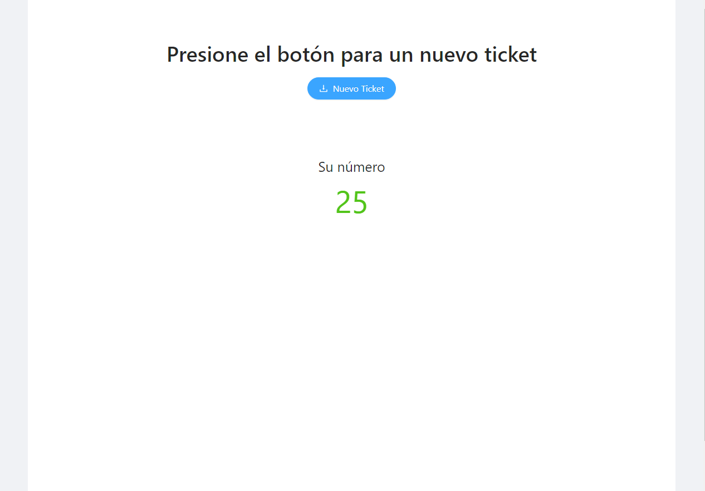
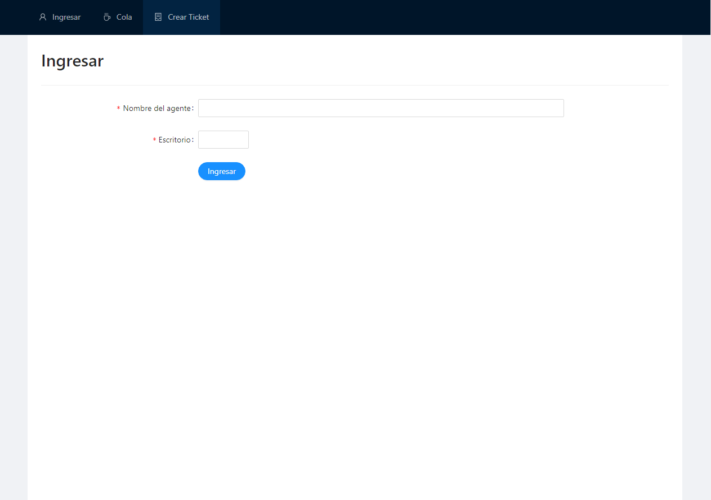
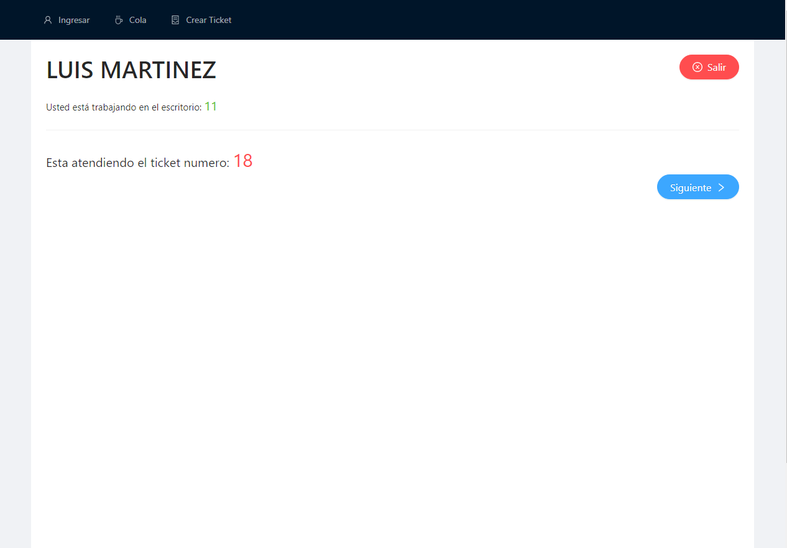
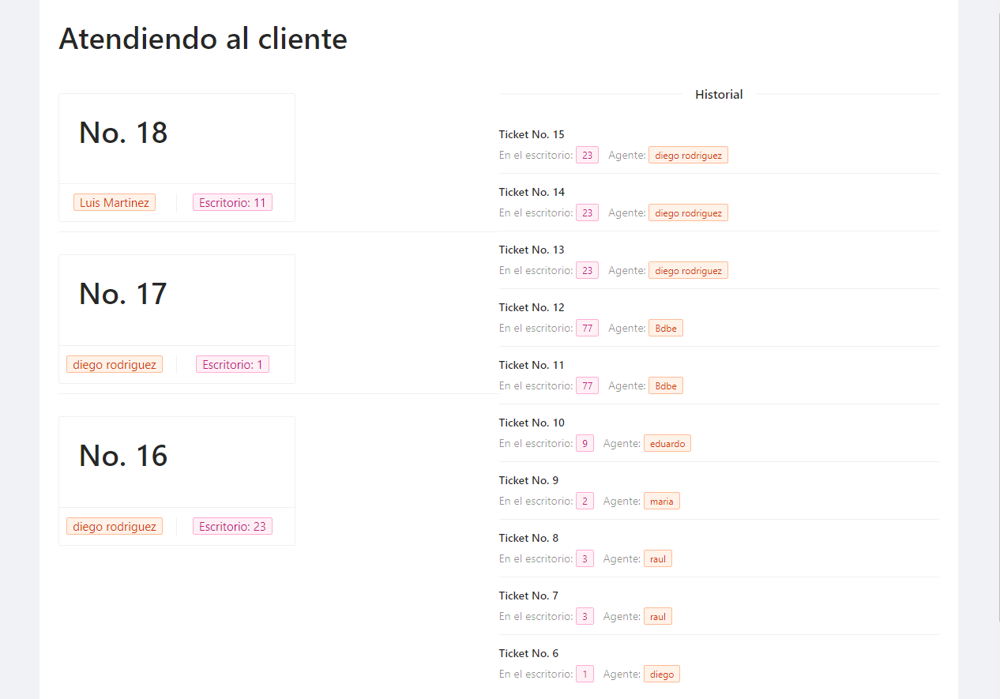

# Ticket Socket App

Aplicación de tickets utilizando socket.io.
<br />

## Funcionamiento

Sitio Web - [Ticket App](https://ticket-app-mauve.vercel.app/).
* URL `https://ticket-app-mauve.vercel.app/`

### Creación de tickets
* Puede generar tickets en `/ticket`




### Pantalla de ingreso

* Ingrese nombre del agente y escritorio para acceder al escritorio



### Escritorio

* Puede salir para ingresar otro agente o puede apretar siguiente para pasar al siguiente ticket a atender.
* Pruebe abriendo otra ventana en modo incognito u otro navegador e ingrese con otro agente 



### Cola de espera

 * Aca se muestra los tickets que estan atendiendo todos los agentes y un historial de los atendidos

 * path `/cola`




## Built With 🛠️


* [React.js](https://es.reactjs.org/)
* [Socket.io](https://socket.io/)
* [Ant Design](https://ant.design/)

## Backend

 - [Backend-ticket-app](https://github.com/DiegoRodriguez-sc/ticket-app-backend)

## Getting Started 🚀

Para obtener una copia local en funcionamiento, siga estos sencillos pasos de ejemplo.

### Installation

1. Clone the repo
   ```sh
   git clone https://github.com/DiegoRodriguez-sc/ticket-app-front.git
   ```
2. Install NPM packages
   ```sh
   npm install
   ```


## Contact ☎️

 * [Linkedin](www.linkedin.com/in/diego-rodriguez-sc)

* Project Link: [https://github.com/DiegoRodriguez-sc/ticket-app-front](https://github.com/DiegoRodriguez-sc/ticket-app-front)
